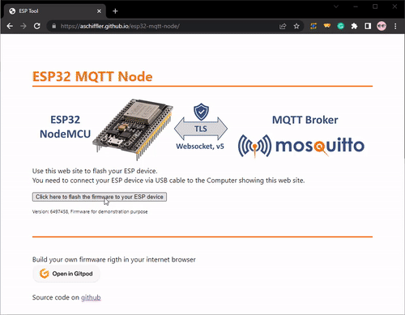
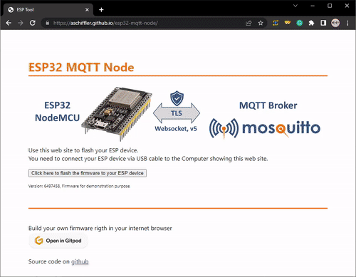

# ESP32 MQTT-Node
Firmware to demonstrate the use of the [mqtt libary](https://docs.espressif.com/projects/esp-idf/en/latest/esp32/api-reference/protocols/mqtt.html) on a ESP32 node_mcu board using the [esspresif development framework](https://github.com/espressif/esp-idf).

MQTT keywords addressed
* MQTT Protocol V5.0
* Secure Websocket transport (wss://<BROKER>)
* Certificate Validation based on bundled root certififcates

## Flash the pre-built firmware
* Point your browser to [https://aschiffler.github.io/esp32-mqtt-node](https://aschiffler.github.io/esp32-mqtt-node)
* Follow the instructions to connect your physical device



Note: Wifi connection is limited to WPA2-PSK with the pre-built firmware. Configure other options in the menu before buidling a custom firmware by (```idf.py menuconfig```)

## Use the Application after flashing
* Point your browser to [https://aschiffler.github.io/esp32-mqtt-node](https://aschiffler.github.io/esp32-mqtt-node)
* Follow the instructions to connect your physical device
* Start the serial console in the browser
* Typ in your information: wifi, broker (wss://, ws://, mqtt:// and mqtts:// is supported, eg. mqtts://mqtt.cedalo.cloud:8883), protocol version 5 || 3, login credentials




## Build and flash your own firmware right in the browser powered by gitpod.io
[](https://gitpod.io/#https://github.com/aschiffler/esp32-mqtt-node)

* Open the development environment ```gitpod```` (github account needed)
* Modify the code under ```main/app_main.c```
* Build the firmware with ```idf.py build```
* Flash the firmware by the Web Flash Tool -> Find the link under ```Ports```


Based on MQTT Libary examples: [https://github.com/espressif/esp-idf/blob/1c84cfde14dcffdc77d086a5204ce8a548dce935/examples/protocols/mqtt5/main/app_main.c#L191](https://github.com/espressif/esp-idf/blob/1c84cfde14dcffdc77d086a5204ce8a548dce935/examples/protocols/mqtt5/main/app_main.c#L191)